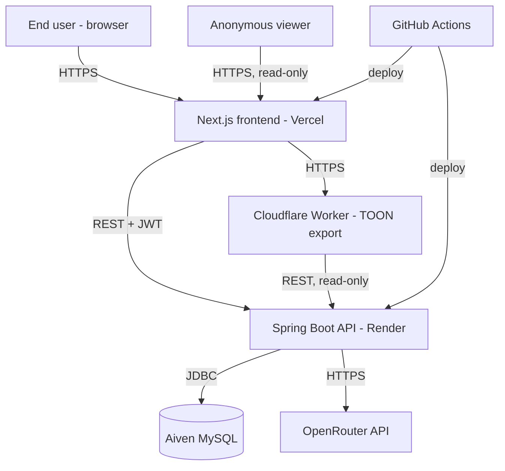
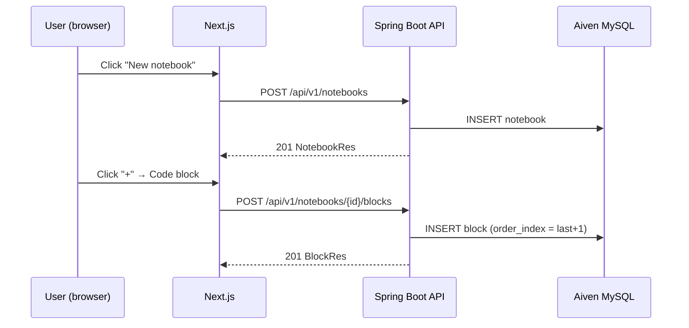
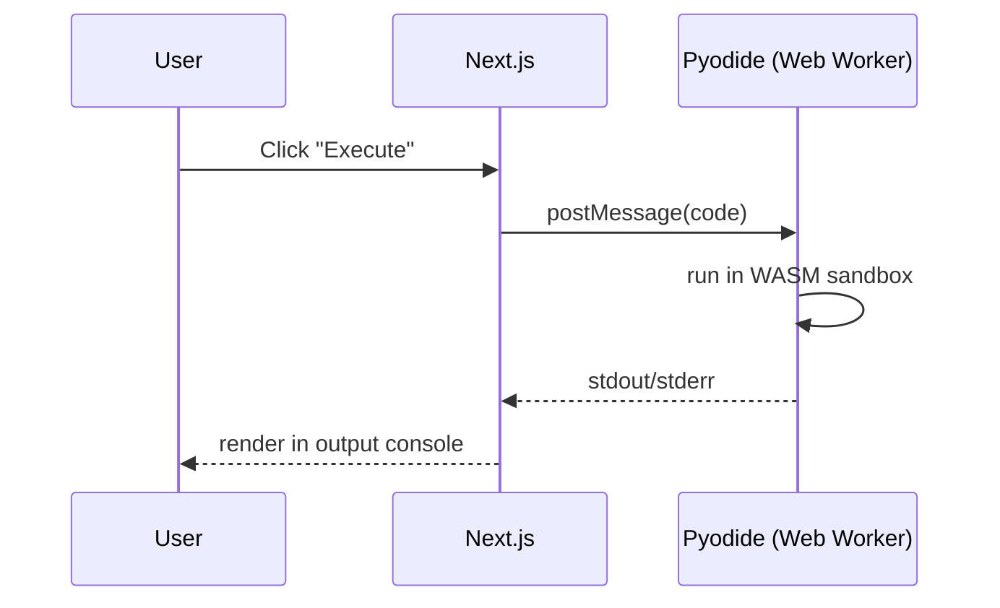
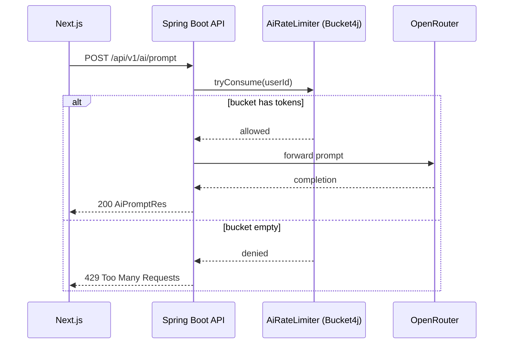
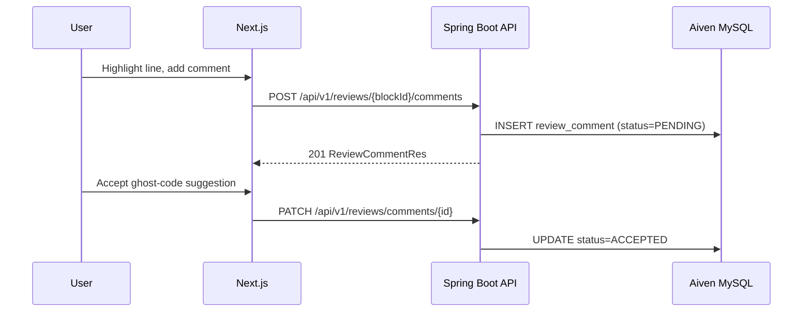
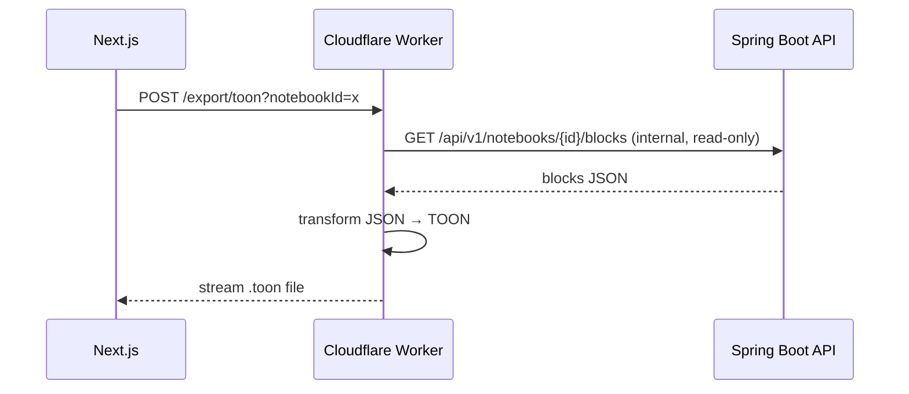
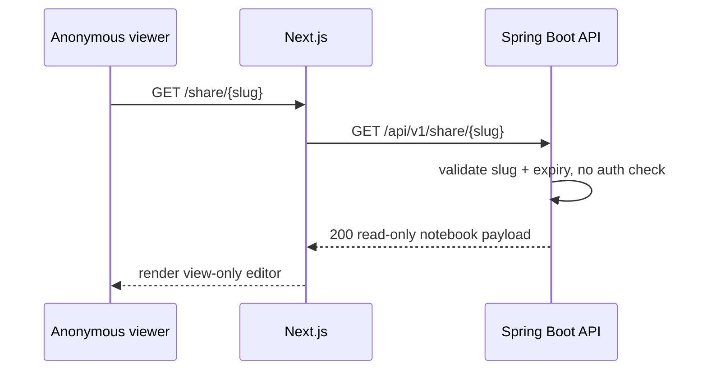
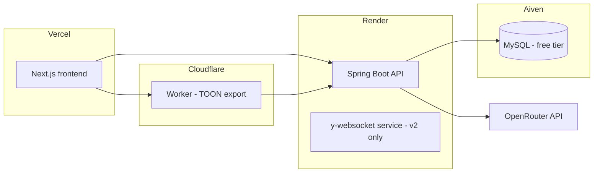

# High-Level Design (HLD)
**Project:** All-in-One Developer Notebook
**References:** FRD, TRD v2
**Scope covered:** MVP + v1.5. v2 items (realtime collaboration, knowledge graph, offline-first, multi-language execution) are called out separately and excluded from the flows below.

---

## 1. Purpose

Define the logical architecture, component responsibilities, and key data flows for the notebook platform, so backend/frontend scaffolding in the next phase follows one agreed shape instead of being decided ad hoc per file.

## 2. Actors

| Actor | Description |
|---|---|
| End user | Authenticated developer/learner — owns notebooks, writes blocks, runs code, requests AI help |
| Anonymous viewer | Accesses a notebook only via a public read-only share link, no auth |
| AI provider (OpenRouter) | External system, called by the backend, never called directly from the frontend |
| GitHub Actions | CI/CD actor — builds, tests, deploys on push |

## 3. System Context

## 4. Logical Architecture Layers

| Layer | Contains | Notes |
|---|---|---|
| Presentation | Next.js editor UI, block renderers, skills dashboard, public share viewer | Talks to backend only via typed REST client in `lib/api/` |
| API | Spring Boot controllers | Thin — validation + delegation to services, no business logic here |
| Business logic | Service layer (Notebook, Block, Review, AI, Skill, Share) | All rules, rate limiting, and orchestration live here |
| Data | Aiven MySQL via Spring Data JPA | Single source of truth; no data duplicated in a second store |
| Infrastructure | Cloudflare Worker (export transform), OpenRouter (AI), Pyodide (client-side execution) | Each is replaceable independently of the others |

## 5. Component Responsibilities

| Component | Responsibility | Notes |
|---|---|---|
| NotebookService | CRUD for notebooks, folder hierarchy | Owns `parent_folder_id` tree logic |
| BlockService | CRUD + reorder for blocks inside a notebook | Owns `order_index` maintenance |
| ReviewService | Threaded line comments, ghost-code suggestion lifecycle | Comment resolution state machine: `PENDING → ACCEPTED/REJECTED` |
| AiService | Wraps OpenRouter calls, applies rate limiter, shapes prompts per block type | Only component allowed to call OpenRouter |
| SkillService | Tracks per-user mastery + streaks | Reads block language/topic tags, no direct AI dependency |
| ShareService | Issues/validates read-only share links | No auth check on the read path — validity check only |
| Export pipeline | Notebook JSON → MD/PDF/JSON in-process; JSON → TOON via Cloudflare Worker | Worker never touches the DB directly — always goes through `ExportController` |

## 6. Key Data Flows

### 6.1 Create notebook and add a block

### 6.2 Execute a Python code block (client-side, MVP)

No backend involvement — this is fully client-side by design, per TRD §5 sandboxing rules.

### 6.3 AI Prompt Block request

### 6.4 Code review thread

### 6.5 Export to TOON

Bypasses the Java server's CPU for the transform itself — matches TRD §4.2 (save compute cycles).

### 6.6 Public share link access

## 7. Deployment View

## 8. Non-Functional Requirements

| Concern | Decision |
|---|---|
| Performance | Render free tier cold start (30–90s) accepted for MVP; mitigate with a free uptime pinger if demo-readiness matters |
| Security | Stateless JWT auth; all client-side code execution sandboxed in Web Workers/WASM; no server-side arbitrary code execution in MVP |
| Scalability | Single-node free tier by design — this is a portfolio project, not a production SLA. Aiven/Render both support one-click paid upgrade with no migration if ever needed |
| Availability | Render sleep-on-idle is an accepted trade-off, not a defect, for a zero-budget deployment |
| API versioning | All endpoints prefixed `/api/v1/` to allow non-breaking evolution later |

## 9. Cross-Cutting Concerns

- **Error handling:** centralized via `GlobalExceptionHandler` (`@ControllerAdvice`) — every custom exception maps to one HTTP status and one error body shape (see LLD §9).
- **Rate limiting:** only the AI Prompt endpoint is rate-limited in MVP; extend `AiRateLimiter` if other endpoints need it later.
- **Auditability:** `created_at`/`updated_at` on every entity — required for skills streak calculation and version history later.

## 10. Traceability (FRD → HLD component)

| FRD requirement | HLD component |
|---|---|
| §3.1 Block-based editor | Presentation layer, BlockService |
| §3.2 Code execution | Pyodide (client), BlockService |
| §3.3 Project/file management | NotebookService |
| §3.4 Export/interoperability | Export pipeline |
| §4.1 Inline code review | ReviewService |
| §4.2 AI integration | AiService, AiRateLimiter |
| Skills tracking (feature list) | SkillService |
| Sharing (this conversation) | ShareService |