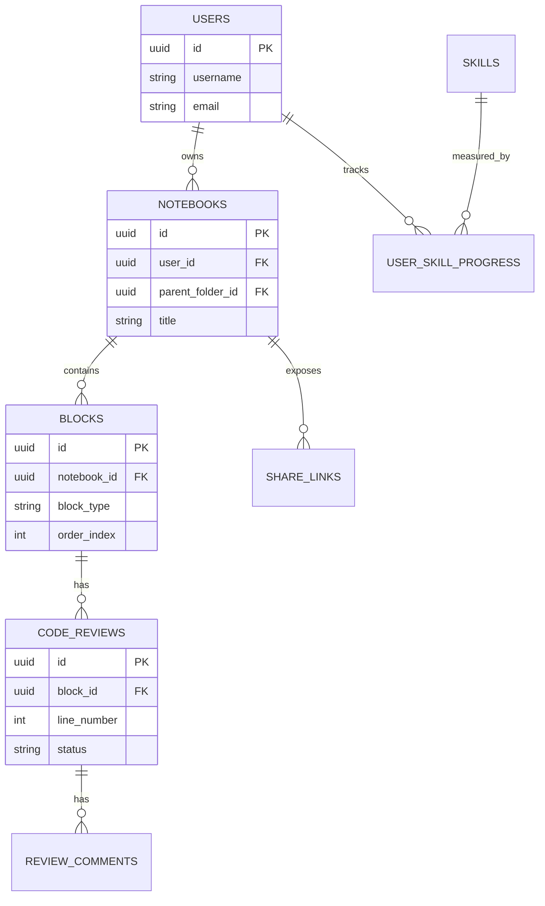

# Low-Level Design (LLD)
**Project:** All-in-One Developer Notebook
**References:** FRD, TRD v2, HLD
**Scope:** MVP + v1.5 entities/endpoints. v2 items intentionally excluded.

---

## 1. Entity Design

### User
| Field | Type | Constraints |
|---|---|---|
| id | UUID | PK |
| username | VARCHAR(50) | unique, not null |
| email | VARCHAR(255) | unique, not null |
| password_hash | VARCHAR(255) | not null |
| created_at | TIMESTAMP | not null, default now |

### Notebook
| Field | Type | Constraints |
|---|---|---|
| id | UUID | PK |
| user_id | UUID | FK → User.id |
| title | VARCHAR(255) | not null |
| parent_folder_id | UUID | FK → Notebook.id, nullable (self-referential tree) |
| created_at / updated_at | TIMESTAMP | not null |

### Block
| Field | Type | Constraints |
|---|---|---|
| id | UUID | PK |
| notebook_id | UUID | FK → Notebook.id |
| block_type | ENUM | TEXT, CODE, AI_PROMPT, REVIEW, DIAGRAM |
| content | JSON | schema varies by block_type — see §10 |
| order_index | INT | not null, maintained by BlockService |
| language | VARCHAR(30) | nullable, only used when block_type = CODE |

### CodeReview
| Field | Type | Constraints |
|---|---|---|
| id | UUID | PK |
| block_id | UUID | FK → Block.id |
| line_number | INT | not null |
| suggestion_text | TEXT | ghost-code suggestion body |
| status | ENUM | PENDING, ACCEPTED, REJECTED |

### ReviewComment (new in v2 of TRD)
| Field | Type | Constraints |
|---|---|---|
| id | UUID | PK |
| code_review_id | UUID | FK → CodeReview.id |
| author_id | UUID | FK → User.id |
| body | TEXT | not null |
| created_at | TIMESTAMP | not null |

### ShareLink
| Field | Type | Constraints |
|---|---|---|
| id | UUID | PK |
| notebook_id | UUID | FK → Notebook.id |
| slug | VARCHAR(20) | unique, indexed — used in public URL |
| expires_at | TIMESTAMP | nullable — null means no expiry |
| view_only | BOOLEAN | default true |

### Skill
| Field | Type | Constraints |
|---|---|---|
| id | UUID | PK |
| name | VARCHAR(50) | e.g. "Python", "Recursion" |
| category | VARCHAR(30) | LANGUAGE, TOPIC |

### UserSkillProgress
| Field | Type | Constraints |
|---|---|---|
| id | UUID | PK |
| user_id | UUID | FK → User.id |
| skill_id | UUID | FK → Skill.id |
| mastery_level | ENUM | LEARNING, PRACTICING, MASTERED |
| streak_count | INT | default 0 |
| last_practiced_at | TIMESTAMP | nullable |

## 2. Entity Relationship Diagram



## 3. API Specification

All endpoints prefixed `/api/v1`. Auth column: `JWT` = requires valid token, `Public` = no auth.

| Method | Path | Request DTO | Response DTO | Auth | Rate limit |
|---|---|---|---|---|---|
| POST | /auth/register | RegisterReq | JwtAuthRes | Public | — |
| POST | /auth/login | LoginReq | JwtAuthRes | Public | — |
| GET | /notebooks | — | List\<NotebookRes\> | JWT | — |
| POST | /notebooks | CreateNotebookReq | NotebookRes | JWT | — |
| PUT | /notebooks/{id} | UpdateNotebookReq | NotebookRes | JWT | — |
| DELETE | /notebooks/{id} | — | 204 | JWT | — |
| GET | /notebooks/{id}/blocks | — | List\<BlockRes\> | JWT | — |
| POST | /notebooks/{id}/blocks | CreateBlockReq | BlockRes | JWT | — |
| PATCH | /blocks/{id}/reorder | ReorderReq | 204 | JWT | — |
| POST | /reviews/{blockId}/comments | CreateCommentReq | ReviewCommentRes | JWT | — |
| PATCH | /reviews/comments/{id} | UpdateStatusReq | ReviewCommentRes | JWT | — |
| POST | /ai/prompt | AiPromptReq | AiPromptRes | JWT | 1 req/user, refill per TRD §5 |
| GET | /skills/progress | — | List\<SkillProgressRes\> | JWT | — |
| POST | /notebooks/{id}/share | CreateShareReq | ShareLinkRes | JWT | — |
| GET | /share/{slug} | — | PublicNotebookRes | Public | — |
| POST | /export/{notebookId} | ExportReq (format=md\|pdf\|json) | file stream | JWT | — |

Note: `/export/{notebookId}?format=toon` is called by the Cloudflare Worker, not the frontend directly — Worker holds a service-level credential, not a user JWT.

## 4. Service Layer Contracts

```java
public interface NotebookService {
    NotebookRes create(UUID userId, CreateNotebookReq req);
    List<NotebookRes> listForUser(UUID userId);
    NotebookRes update(UUID notebookId, UpdateNotebookReq req);
    void delete(UUID notebookId);
}

public interface BlockService {
    BlockRes addBlock(UUID notebookId, CreateBlockReq req);
    void reorder(UUID blockId, int newIndex);
    List<BlockRes> listForNotebook(UUID notebookId);
}

public interface AiService {
    AiPromptRes prompt(UUID userId, AiPromptReq req); // calls AiRateLimiter.tryConsume() first
}

public interface ShareService {
    ShareLinkRes createLink(UUID notebookId, CreateShareReq req);
    PublicNotebookRes resolve(String slug); // throws ResourceNotFoundException if expired/invalid
}
```

## 5. Rate Limiter Configuration (Bucket4j)

```java
Bandwidth limit = Bandwidth.classic(5, Refill.intervally(5, Duration.ofMinutes(1)));
// 5 AI prompt requests per user per minute — adjust once real usage data exists
```

Bucket keyed by `userId`, stored in-memory (single Render instance — no distributed cache needed at this scale). If the app ever runs multiple instances, swap to a Bucket4j Redis backend.

## 6. Security Filter Chain Order

1. `CorsFilter` (from `AppConfig`)
2. `JwtAuthenticationFilter` — validates token, sets `SecurityContext`
3. Spring Security's standard `FilterSecurityInterceptor` — enforces `@PreAuthorize` rules
4. `ShareController` endpoints are explicitly excluded from JWT requirement in `SecurityConfig` (`permitAll()` on `/api/v1/share/**`)

## 7. Sequence Detail — AI Prompt with Rate Limit Denial

Already diagrammed in HLD §6.3. Implementation note: `AiRateLimiter.tryConsume()` must run **before** any OpenRouter call is made, not after — a denied request must never reach the AI provider, both for cost control on OpenRouter's side and to keep the 429 response fast.

## 8. Block Content JSON Schemas

**TEXT block:**
```json
{ "markdown": "## Heading\nSome **bold** text" }
```

**CODE block:**
```json
{ "language": "python", "source": "a = 10\nb = 12\nprint(a + b)", "lastOutput": "22" }
```

**AI_PROMPT block:**
```json
{ "prompt": "Explain this function", "targetBlockId": "uuid", "response": "..." }
```

**REVIEW block (rendered, not stored standalone — attached to a CODE block via CodeReview):**
```json
{ "lineNumber": 4, "suggestion": "Use list comprehension here", "status": "PENDING" }
```

## 9. Error Code Table

| Exception | HTTP status | Body shape |
|---|---|---|
| ResourceNotFoundException | 404 | `{ "error": "not_found", "message": "..." }` |
| UnauthorizedException | 401 | `{ "error": "unauthorized", "message": "..." }` |
| Rate limit denied (custom) | 429 | `{ "error": "rate_limited", "retryAfterSeconds": n }` |
| Validation failure (`@Valid`) | 400 | `{ "error": "validation_failed", "fields": { "field": "message" } }` |
| Uncaught | 500 | `{ "error": "internal_error" }` — never leaks stack trace to client |

## 10. Open Items for LLD v2

- Realtime collaboration message schema (Yjs update format) — deferred with the feature itself
- Knowledge graph edge model (likely a `BlockLink` join entity: `sourceBlockId`, `targetBlockId`, `linkType`)
- Offline-first sync conflict resolution strategy (IndexedDB → server reconciliation)